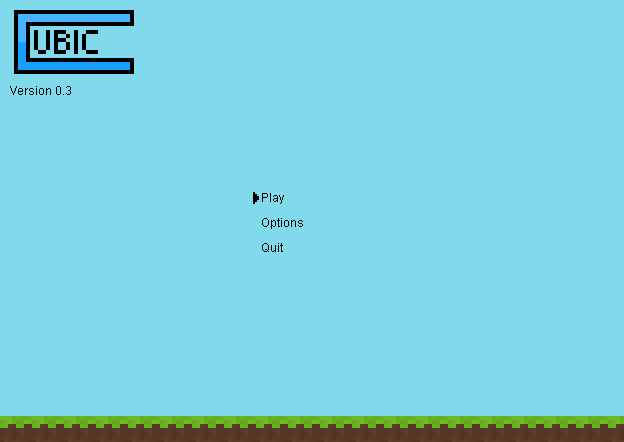
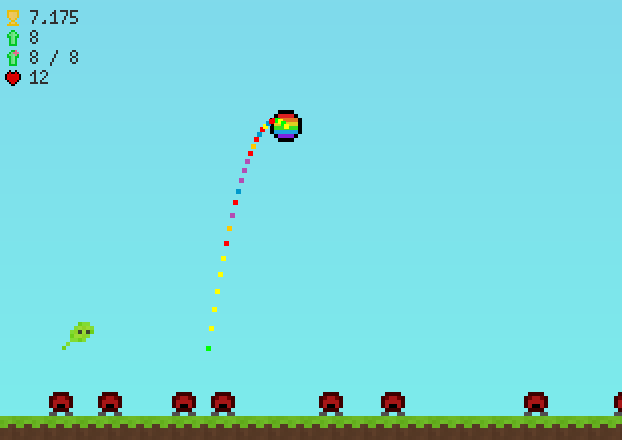

# Cubic
A simple platformer game written in Java.

**Latest version: [0.3.0 Beta 1](https://github.com/Juuxel/Cubic/releases/tag/v0.3.0-beta1)**

## Links
- [Releases](https://github.com/Juuxel/Cubic/releases)
- [Ideas](https://gist.github.com/Juuxel/e671f472a1437255cdd5/9d4933cb1e0366ac3e068f8ef55cfb13a5864cd7)

## Screenshots



## Building
### Linux
Install JDK and run ```./gradlew build``` in a terminal.
### Windows
Install JDK and run ```gradlew build``` in Command Prompt.
