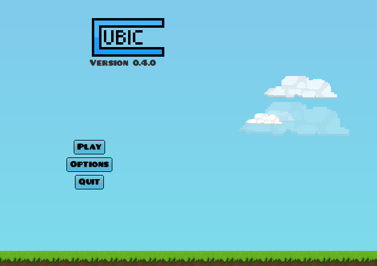
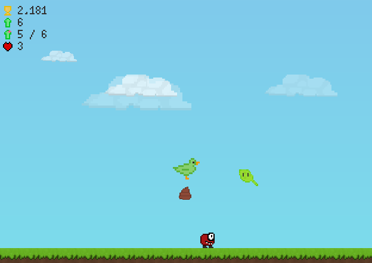

# Cubic
A simple platformer game written in Java.

**Latest version: [0.4.1 - 2018 Edition](https://github.com/Juuxel/Cubic/releases/tag/v0.4.1)**

## Screenshots



## Building
### Linux
Install JDK and run ```./gradlew build``` in a terminal.
### Windows
Install JDK and run ```gradlew build``` in Command Prompt.
